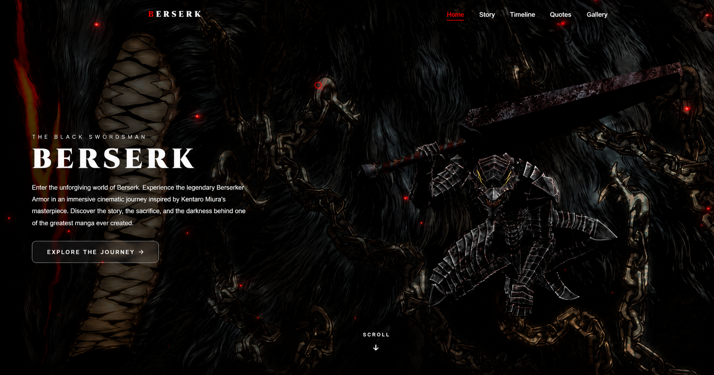

# ⚔️ BERSERK — A Cinematic Tribute Website

A dark, immersive React website built as a fan tribute to **Berserk**, Kentaro Miura's legendary manga. It brings the Black Swordsman's world to life through a rotating 3D Berserker Armor, cinematic scroll animations, and a complete journey through Guts's story — from the Brand of Sacrifice to the Eclipse and beyond.

This isn't just a static landing page. It's built with real 3D rendering (Three.js), buttery-smooth scrolling (Lenis), and motion design (Framer Motion) to make the experience feel like part of the story itself.

<p align="center">
  
</p>

<p align="center">
  <a href="berserk-cinematic-website.vercel.app"><strong>🔴 Live Demo</strong></a>
  &nbsp;·&nbsp;
  <a href="#getting-started">Getting Started</a>
  &nbsp;·&nbsp;
  <a href="#tech-stack">Tech Stack</a>
</p>


---

## ✨ What's Inside

- **Hero section** with a rotating 3D Berserker Armor model, particle effects, and a cinematic intro animation
- **Story section** — Guts's history told through the lens of the Brand of Sacrifice and the Berserker Armor
- **Timeline** — key moments from the manga, laid out chronologically
- **Quotes** — memorable lines from the series in a clean, readable card layout
- **Gallery** — a curated set of scene stills from the story
- Fully responsive layout — the experience looks and feels the same whether you're on a phone, tablet, or a large desktop monitor
- Smooth-scroll navigation with an active-section indicator in the navbar
- A custom loading screen and cursor for that extra bit of atmosphere

---

## 🖥️ Tech Stack

| Category | Technology |
|---|---|
| Framework | [React 19](https://react.dev) |
| Build Tool | [Vite](https://vitejs.dev) |
| Styling | [Tailwind CSS v4](https://tailwindcss.com) |
| Animation | [Framer Motion](https://www.framer.com/motion/) |
| 3D Rendering | [Three.js](https://threejs.org) via [React Three Fiber](https://docs.pmnd.rs/react-three-fiber) & [Drei](https://github.com/pmndrs/drei) |
| Smooth Scrolling | [Lenis](https://lenis.darkroom.engineering/) |
| Icons | [React Icons](https://react-icons.github.io/react-icons/) |
| Linting | ESLint |

---

## 📁 Project Structure

```
berserk-website/
├── assets/                    # Preview images used in this README
│   └── website-preview.png
├── public/
│   ├── images/
│   │   ├── logo/              # Site logo / favicon
│   │   ├── band_of_the_hawk/             # Loading screen band mark
│   │   ├── backgrounds/       # Hero background artwork
│   │   └── gallery/           # Gallery scene stills
│   └── models/
│       └── berserk_armor.glb  # 3D Berserker Armor model
├── src/
│   ├── components/
│   │   ├── layout/            # Navbar, Footer
│   │   ├── sections/          # Hero, Story, Timeline, Quotes, Gallery
│   │   └── ui/                # Loader, Cursor, 3D Model, Scroll Indicator, etc.
│   ├── data/                  # Content: navigation links, quotes, timeline, gallery
│   ├── hooks/                 # useLenis, useScrollSpy, useMediaQuery
│   ├── App.jsx                 # Root component
│   ├── main.jsx                # Entry point
│   └── index.css               # Tailwind + global styles
├── index.html
├── vite.config.js
└── package.json
```

---

## 🚀 Getting Started

### Prerequisites

Make sure you have these installed on your machine:

| Tool | Minimum Version |
|---|---|
| [Node.js](https://nodejs.org) | 18.x or higher |
| npm | 9.x or higher (comes with Node.js) |

Check what you have installed:

```bash
node --version
npm --version
```

### 1. Get the code

Clone the repo:

```bash
git clone <your-repo-url>
cd berserk-website
```

Or, if you downloaded this as a ZIP, just extract it and open a terminal inside the `berserk-website` folder.

### 2. Install dependencies

```bash
npm install
```

This pulls in React, Vite, Tailwind, Three.js, Framer Motion, and everything else the project needs.

### 3. Start the dev server

```bash
npm run dev
```

Vite will print a local URL in your terminal (usually `http://localhost:5173`) — open it in your browser and you're good to go.

### 4. Build for production

```bash
npm run build
```

The optimized, production-ready output lands in the `dist/` folder. You can preview it locally before deploying:

```bash
npm run preview
```

---

## 📜 Available Scripts

| Command | What it does |
|---|---|
| `npm run dev` | Starts the local dev server with hot reload |
| `npm run build` | Builds an optimized production bundle |
| `npm run preview` | Serves the production build locally so you can sanity-check it |
| `npm run lint` | Runs ESLint across the project |

---

## 🌐 Deployment

This project deploys cleanly to [Vercel](https://vercel.com) with zero configuration — it's a standard Vite + React app.

1. Push this project to a GitHub repository
2. Import the repo into Vercel
3. Vercel will auto-detect the Vite framework preset (build command: `npm run build`, output directory: `dist`)
4. Deploy — that's it

Once deployed, swap in your real URL at the top of this README so anyone visiting the repo can try the live site before downloading the code.

---

## 🖼️ Assets Reference

All image and model assets live under `public/`, organized by purpose so they're easy to find and swap out:

```
public/images/
├── logo/         → berserk-logo.png        (favicon / site logo)
├── band_of_the_hawk/        → berserk-band-mark.png  (loading screen)
├── backgrounds/  → hero-background.png     (hero section backdrop)
└── gallery/      → gallery-01.jpg … gallery-06.png
```

The 3D armor model lives at `public/models/berserk_armor.glb`. If any of these files go missing, the corresponding section will still render, just without that visual — nothing will crash.

---

## 📱 Browser & Device Support

Tested and working across modern Chrome, Firefox, Safari, and Edge. The layout is fully responsive — mobile, tablet, laptop, and desktop users all get the same carefully-tuned experience, just scaled appropriately for their screen.

---

## ⚠️ A Note on This Project

This is a fan-made tribute built purely out of love for the source material. **Berserk** and all related characters, artwork, and story elements are © Kentaro Miura / Studio Gaga / Hakusensha. This project claims no ownership over the original work — it exists to celebrate it.

---

## 📄 License

Fan tribute project, built for educational and portfolio purposes. All rights to Berserk belong to their respective owners.

Made with ⚔️ by **Umarcraft247@gmail.com**

---

## If you enjoyed this project, consider giving it a ⭐ on GitHub.